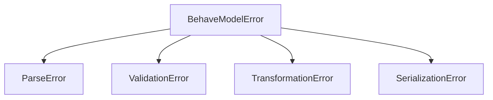

# API Reference — Exceptions

All exceptions inherit from `BehaveModelError`.



## BehaveModelError

Base exception for all `behave-model` errors.

```python
from behave_model import BehaveModelError

try:
    # ... any operation ...
except BehaveModelError as e:
    print(f"behave-model error: {e}")
```

---

## ParseError

Raised when a `.feature` file cannot be parsed.

```python
from behave_model import ParseError
```

---

## ValidationError

Raised when validation encounters a critical error (not to be confused with `ValidationIssue`).

```python
from behave_model import ValidationError
```

---

## TransformationError

Raised when a transformation fails (e.g., feature not found).

```python
from behave_model import TransformationError
```

---

## SerializationError

Raised when serialization fails.

```python
from behave_model import SerializationError
```
