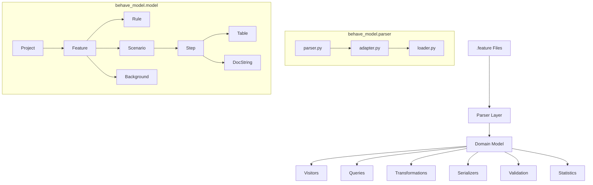
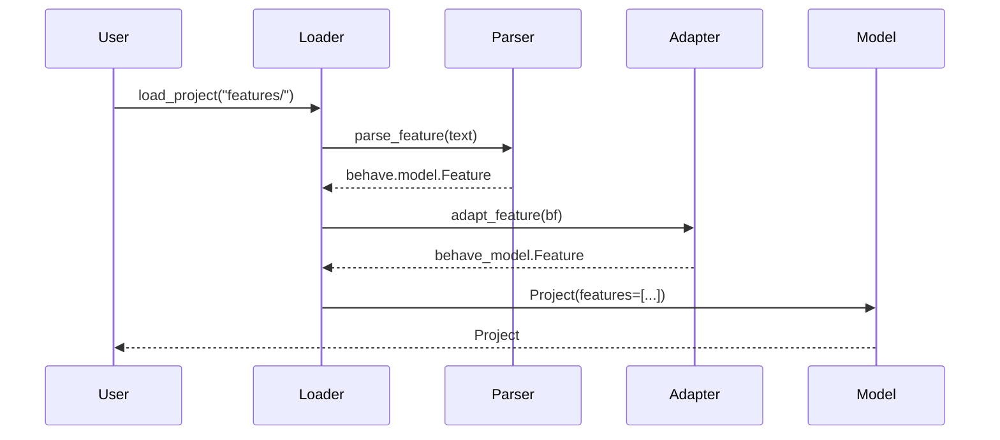
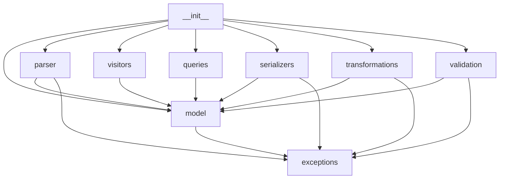

# Architecture Overview

`behave-model` is built in layers, each with a single responsibility. This design makes the library easy to understand, test, and extend.

## Layer diagram

## Layer details

### Parser Layer (`behave_model.parser`)

Wraps Behave's built-in parser and converts results into behave-model domain objects.

| Module | Responsibility |
| --- | --- |
| `parser.py` | Low-level parse functions (`parse_feature`, `parse_project`) |
| `adapter.py` | Converts `behave.model.*` objects → `behave_model.*` objects |
| `loader.py` | File/directory loading (`load_feature`, `load_project`) |

**Key design decision**: We don't reimplement Gherkin parsing. We reuse Behave's battle-tested parser and adapt its output. This ensures full compatibility with all Gherkin syntax including edge cases.

### Domain Model (`behave_model.model`)

Pure frozen dataclasses with no external dependencies. Every node has:

- A `Location` (filename, line, column) for traceability
- An `accept(visitor)` method (for visitable nodes)
- Container protocol support (`__len__`, `__iter__`, `__getitem__`)

| Class | Represents |
| --- | --- |
| `Project` | Root container for all features |
| `Feature` | A single `.feature` file |
| `Rule` | Gherkin v6 Rule block |
| `Background` | Shared steps before each scenario |
| `Scenario` | A concrete scenario |
| `ScenarioOutline` | A data-driven scenario with Examples |
| `Step` | A Given/When/Then step |
| `Table` | A data table |
| `TableRow` | A row in a data table |
| `Tag` | A tag label |
| `DocString` | A multi-line text block |
| `Examples` | Examples block for ScenarioOutline |
| `Location` | Source location (filename, line, column) |
| `Comment` | A comment line |
| `Metadata` | Optional metadata container |

### Visitors (`behave_model.visitors`)

Generic visitor pattern for tree traversal.

| Class | Description |
| --- | --- |
| `Visitor` | Base class — override `visit_*` methods |
| `CountingVisitor` | Counts nodes by type |
| `CollectingVisitor` | Collects nodes by type into lists |

### Queries (`behave_model.queries`)

High-level filtering functions mixed into `Project`:

- `find_feature(name)` — Find feature by exact name
- `find_tag(name)` — Find tag by exact name
- `find_scenarios(tag=, name=, name_contains=)` — Filter scenarios
- `find_steps(keyword=, text_contains=)` — Filter steps
- `find_features_with_tag(tag)` — Features with a tag
- `find_scenarios_with_tag(tag)` — Scenarios with a tag
- `find_outlines()` — All Scenario Outlines
- `find_plain_scenarios()` — All plain Scenarios

### Transformations (`behave_model.transformations`)

Safe, in-place mutations that preserve semantic meaning:

- `rename_tag`, `rename_scenario`
- `sort_tags`, `sort_features`, `sort_scenarios`
- `normalize_whitespace`
- `remove_tag`, `add_tag_to_feature`

### Serializers (`behave_model.serializers`)

| Serializer | Output format |
| --- | --- |
| `DictSerializer` | Python `dict` |
| `JsonSerializer` | JSON string |
| `PrettyPrinter` | Gherkin `.feature` text |

### Validation (`behave_model.validation`)

Pluggable rule framework with built-in rules:

| Rule | Severity |
| --- | --- |
| `DuplicateScenarioNamesRule` | error |
| `DuplicateFeatureNamesRule` | error |
| `EmptyScenarioRule` | warning |
| `EmptyFeatureRule` | warning |
| `InvalidTableRule` | error |

Custom rules extend `ValidationRule` and implement `check(project)`.

## Data flow

## Module dependencies

The `model` package has zero dependencies on other `behave_model` packages. All other packages depend on `model` and `exceptions` only.

## Next steps

- [Design Decisions](design_decisions.md) — Why things are the way they are
- [Domain Model Guide](guides/domain_model.md) — Detailed guide to every class
- [API Reference](api/overview.md) — Complete API documentation
