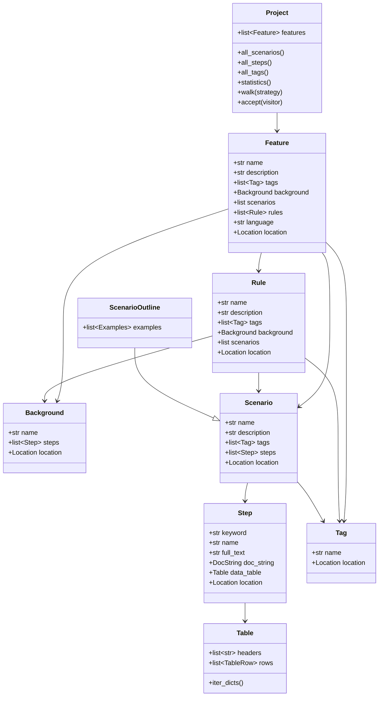

# Domain Model Guide

The domain model is the heart of `behave-model`. Every element in a `.feature` file maps to a Python dataclass with typed attributes, container protocol support, and a `Location` for traceability.

## Class hierarchy



## Project

The root container for all parsed features.

```python
from behave_model import load_project, Project

project = load_project("features/")

# Container protocol
len(project)        # number of features
project[0]          # first feature
for f in project:   # iterate features
    print(f.name)
```

### Key methods

| Method | Returns | Description |
| --- | --- | --- |
| `features` | `list[Feature]` | All features in the project |
| `all_scenarios()` | `list[Scenario \| ScenarioOutline]` | Every scenario across all features (including those in Rules) |
| `all_steps()` | `list[Step]` | Every step across all features |
| `all_tags()` | `list[Tag]` | Every tag in the project |
| `statistics()` | `dict` | Project metrics (features, scenarios, steps, tags, averages) |
| `walk(strategy="dfs")` | `Iterator` | Traverse the entire tree (DFS or BFS) |
| `accept(visitor)` | `None` | Accept a visitor |
| `find_feature(name)` | `Feature \| None` | Find feature by exact name |
| `find_tag(name)` | `Tag \| None` | Find tag by exact name |
| `find_scenarios(...)` | `list` | Filter scenarios by tag, name, or name_contains |
| `find_steps(...)` | `list[Step]` | Filter steps by keyword or text_contains |
| `find_features_with_tag(tag)` | `list[Feature]` | Features that have a given tag |
| `find_scenarios_with_tag(tag)` | `list` | Scenarios that have a given tag |
| `find_outlines()` | `list[ScenarioOutline]` | All Scenario Outlines |
| `find_plain_scenarios()` | `list[Scenario]` | All plain Scenarios (not Outlines) |

## Feature

Represents a single `.feature` file.

```python
feature = project.features[0]

print(feature.name)          # "Login"
print(feature.tag_names)     # ["@smoke", "@auth"]
print(feature.language)      # "en"
print(feature.background)    # Background object or None
print(len(feature.scenarios))# number of scenarios
print(len(feature.rules))    # number of Gherkin v6 Rules
print(feature.location)      # <features/login.feature:1>
```

### Properties

| Property | Type | Description |
| --- | --- | --- |
| `name` | `str` | Feature name |
| `description` | `str` | Multi-line description text |
| `tags` | `list[Tag]` | Feature-level tags |
| `tag_names` | `list[str]` | Tag names as strings (with `@`) |
| `background` | `Background \| None` | Feature-level background |
| `scenarios` | `list[Scenario \| ScenarioOutline]` | All scenarios (excluding those in Rules) |
| `rules` | `list[Rule]` | Gherkin v6 Rule blocks |
| `language` | `str` | Language code (default `"en"`) |
| `location` | `Location` | Source location (filename, line) |
| `comments` | `list[Comment]` | Comments in the feature file |

## Rule

A Gherkin v6 `Rule` block that groups related scenarios within a Feature.

```python
rule = feature.rules[0]

print(rule.name)             # "Profile updates"
print(rule.tag_names)        # ["@security"]
print(rule.background)       # Rule-specific Background or None
print(len(rule.scenarios))   # number of scenarios in the rule
```

### Properties

| Property | Type | Description |
| --- | --- | --- |
| `name` | `str` | Rule name |
| `description` | `str` | Description text |
| `tags` | `list[Tag]` | Rule-level tags |
| `tag_names` | `list[str]` | Tag names as strings |
| `background` | `Background \| None` | Rule-specific background |
| `scenarios` | `list[Scenario \| ScenarioOutline]` | Scenarios inside the rule |
| `location` | `Location` | Source location |
| `all_steps()` | `list[Step]` | All steps in the rule (including background) |
| `all_scenarios()` | `list` | All scenario-like elements |
| `has_tag(name)` | `bool` | Check if rule has a tag |
| `accept(visitor)` | `None` | Accept a visitor |

## Background

Shared steps that run before each scenario in the containing scope.

```python
bg = feature.background
if bg:
    print(bg.name)           # "Background" or custom name
    for step in bg.steps:
        print(f"  {step.full_text}")
```

## Scenario

A concrete scenario with steps.

```python
for scenario in feature.scenarios:
    print(f"Scenario: {scenario.name}")
    print(f"  Tags: {scenario.tag_names}")
    for step in scenario.steps:
        print(f"  {step.keyword} {step.name}")
```

## ScenarioOutline

Extends `Scenario` with `Examples` for data-driven testing.

```python
from behave_model import ScenarioOutline

for scenario in project.all_scenarios():
    if isinstance(scenario, ScenarioOutline):
        print(f"Outline: {scenario.name}")
        for examples in scenario.examples:
            print(f"  Examples: {examples.name or '(unnamed)'}")
            for row in examples.table.iter_dicts():
                print(f"    {row}")
```

## Step

A single Given/When/Then step.

```python
step = scenario.steps[0]
print(step.keyword)       # "Given"
print(step.name)          # "the user is on the login page"
print(step.full_text)     # "Given the user is on the login page"
print(step.location)      # <features/login.feature:12>

# DocString
if step.doc_string:
    print(step.doc_string.content)

# Data Table
if step.data_table:
    print(step.data_table.headers)
    for row in step.data_table.iter_dicts():
        print(row)
```

## Table

Structured data attached to a step.

```python
table = step.data_table
print(table.headers)        # ["name", "email", "age"]
print(table.num_rows)       # 2
print(table.num_columns)    # 3

for row in table.iter_dicts():
    print(row)
# {'name': 'Alice', 'email': 'alice@test.com', 'age': '30'}
# {'name': 'Bob', 'email': 'bob@test.com', 'age': '25'}
```

## Tag

A label that can be applied to features, rules, and scenarios.

```python
tag = feature.tags[0]
print(tag.name)             # "@smoke"
print(tag.location)         # <features/login.feature:1>
```

## Location

Source location for traceability.

```python
loc = feature.location
print(loc.filename)         # "features/login.feature"
print(loc.line)             # 1
print(loc.column)           # 0
print(str(loc))             # "<features/login.feature:1>"
```

## Container protocol

All container classes (`Project`, `Feature`, `Rule`) support:

```python
len(project)        # number of features
project[0]          # first feature
for f in project:   # iterate
    pass

# Features support iteration over scenarios
for scenario in feature:
    print(scenario.name)
```

## Frozen dataclasses

All model classes are frozen dataclasses — attributes cannot be modified after creation:

```python
from behave_model import Location

loc = Location(filename="a.feature", line=1)
try:
    loc.line = 2  # raises AttributeError
except AttributeError:
    print("Frozen — use transformations instead")
```

## Next steps

- [Gherkin v6 Rules](rules.md) — Deep dive into Rule support
- [Visitors](visitors.md) — Traverse the tree with custom logic
- [API Reference — Model](../api/model.md) — Complete model API
