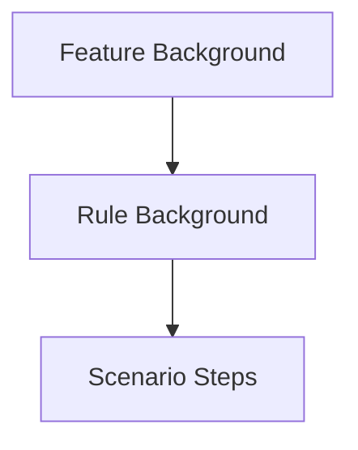

# Gherkin v6 Rules Guide

Gherkin v6 introduced the `Rule` keyword to group related scenarios within a Feature. `behave-model` fully supports Rules as first-class domain objects.

## What is a Rule?

A Rule is a logical grouping of scenarios within a Feature. Rules can have:

- Their own `Background` (in addition to the Feature's Background)
- Their own tags
- Scenarios and Scenario Outlines

```gherkin
@auth
Feature: User Account Management

  Background:
    Given the user is logged in

  Rule: Profile updates
    Background:
      Given the user has a profile

    Scenario: Update display name
      When the user changes their display name to "Alice"
      Then the profile should show "Alice"

  Rule: Password management
    @security
    Scenario: Change password
      When the user changes their password
      Then the password should be updated
```

## Parsing Rules

Rules are parsed automatically when you load a project:

```python
from behave_model import load_project

project = load_project("features/")

for feature in project.features:
    print(f"Feature: {feature.name}")
    print(f"  Rules: {len(feature.rules)}")

    for rule in feature.rules:
        print(f"\n  Rule: {rule.name}")
        print(f"    Tags: {rule.tag_names}")
        print(f"    Scenarios: {len(rule.scenarios)}")
```

Output:

```text
Feature: User Account Management
  Rules: 2

  Rule: Profile updates
    Tags: []
    Scenarios: 2

  Rule: Password management
    Tags: ['@security']
    Scenarios: 2
```

## Rule properties

```python
rule = feature.rules[0]

# Basic properties
print(rule.name)               # "Profile updates"
print(rule.description)        # Optional description text
print(rule.tag_names)          # ["@security"]
print(rule.location)           # <features/rules.feature:10>

# Background (Rule-specific)
if rule.background:
    print("Rule has its own background:")
    for step in rule.background.steps:
        print(f"  {step.full_text}")

# Scenarios
for scenario in rule.scenarios:
    print(f"  {scenario.name}")

# All steps (including background steps)
all_steps = rule.all_steps()
print(f"Total steps: {len(all_steps)}")

# Check tags
if rule.has_tag("@security"):
    print("This rule is security-related")
```

## Background inheritance

When a Rule has its own Background, it runs **in addition to** the Feature's Background:



```python
feature = project.find_feature("User Account Management")
rule = feature.rules[0]  # "Profile updates"

# Feature-level background
print("Feature background:")
for step in feature.background.steps:
    print(f"  {step.full_text}")

# Rule-level background
print("\nRule background:")
for step in rule.background.steps:
    print(f"  {step.full_text}")

# Combined steps (what actually runs before a scenario in this rule)
combined = feature.background.steps + rule.background.steps + rule.scenarios[0].steps
print(f"\nTotal steps executed: {len(combined)}")
```

## Accessing scenarios in Rules

Scenarios inside Rules are accessible via:

1. `rule.scenarios` — only scenarios within that specific Rule
2. `feature.scenarios` — only scenarios **not** inside any Rule
3. `project.all_scenarios()` — **all** scenarios including those in Rules

```python
# Scenarios NOT in rules
print("Feature-level scenarios:")
for s in feature.scenarios:
    print(f"  {s.name}")

# Scenarios inside rules
print("\nRule-level scenarios:")
for rule in feature.rules:
    for s in rule.scenarios:
        print(f"  {s.name}")

# ALL scenarios
print("\nAll scenarios:")
for s in project.all_scenarios():
    print(f"  {s.name}")
```

## Querying Rules

```python
# Find scenarios by tag (includes scenarios in Rules)
for s in project.find_scenarios(tag="@security"):
    print(s.name)

# Find all Scenario Outlines (includes those in Rules)
for outline in project.find_outlines():
    print(outline.name)
```

## Walking the tree

The `walk()` method visits Rule nodes in the tree:

```python
for node in project.walk(strategy="dfs"):
    class_name = type(node).__name__
    if class_name == "Rule":
        print(f"  Rule: {node.name}")
```

## Visitors and Rules

The visitor pattern includes `visit_rule`:

```python
from behave_model import Visitor

class RuleCollector(Visitor):
    def __init__(self):
        self.rules = []

    def visit_rule(self, rule):
        self.rules.append(rule.name)

collector = RuleCollector()
project.accept(collector)
print(collector.rules)
# ['Profile updates', 'Password management']
```

## Serialization

Rules are included in all serializers:

**JSON:**

```python
from behave_model import JsonSerializer
import json

data = json.loads(JsonSerializer().serialize_project(project))
for f in data["features"]:
    for r in f.get("rules", []):
        print(r["name"])
```

**Pretty Print:**

```python
from behave_model import PrettyPrinter

printer = PrettyPrinter()
text = printer.print_feature(feature)
# Rules are printed with proper indentation
print(text)
```

## Next steps

- [Visitors Guide](visitors.md) — Custom tree traversal
- [API Reference — Model](../api/model.md) — Complete Rule API
- [Examples](../examples.md) — Real-world usage
