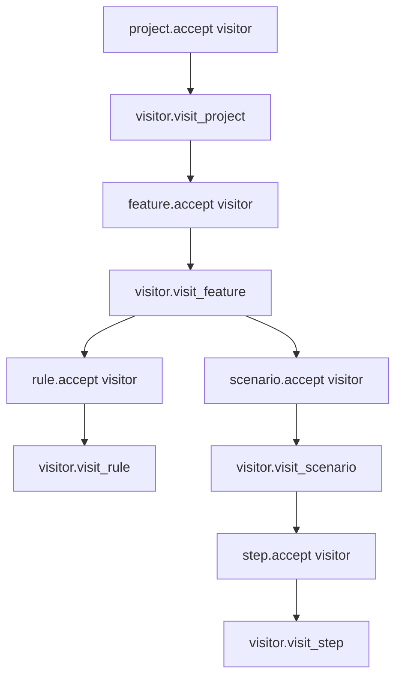

# Visitors Guide

The visitor pattern lets you traverse the entire domain model tree without coupling traversal logic to the model classes.

## How it works

Every visitable node (Project, Feature, Rule, Background, Scenario, ScenarioOutline, Step, Tag, Table, DocString, Examples) implements `accept(visitor)`, which calls the appropriate `visit_*` method on the visitor.



## Base Visitor class

Subclass `Visitor` and override only the `visit_*` methods you need:

```python
from behave_model import Visitor

class MyVisitor(Visitor):
    def visit_project(self, project):
        print(f"Project with {len(project.features)} features")

    def visit_feature(self, feature):
        print(f"  Feature: {feature.name}")

    def visit_scenario(self, scenario):
        print(f"    Scenario: {scenario.name}")

    def visit_step(self, step):
        print(f"      {step.full_text}")
```

## Available visit methods

| Method | Called for |
| --- | --- |
| `visit_project(project)` | Project |
| `visit_feature(feature)` | Feature |
| `visit_rule(rule)` | Rule (Gherkin v6) |
| `visit_background(background)` | Background |
| `visit_scenario(scenario)` | Scenario |
| `visit_scenario_outline(outline)` | ScenarioOutline |
| `visit_examples(examples)` | Examples block |
| `visit_step(step)` | Step |
| `visit_table(table)` | Table |
| `visit_table_row(row)` | TableRow |
| `visit_doc_string(doc_string)` | DocString |
| `visit_tag(tag)` | Tag |

## Built-in visitors

### CountingVisitor

Counts nodes by type:

```python
from behave_model import CountingVisitor

counter = CountingVisitor()
project.accept(counter)

print(counter.counts)
# {'project': 1, 'feature': 4, 'rule': 2, 'scenario': 12, 'step': 45, ...}
```

### CollectingVisitor

Collects nodes by type into lists:

```python
from behave_model import CollectingVisitor

collector = CollectingVisitor()
project.accept(collector)

print(f"Features: {len(collector.features)}")
print(f"Scenarios: {len(collector.scenarios)}")
print(f"Steps: {len(collector.steps)}")
print(f"Rules: {len(collector.rules)}")
```

## Custom visitor examples

### Step keyword counter

```python
from behave_model import Visitor

class KeywordCounter(Visitor):
    def __init__(self):
        self.given = 0
        self.when = 0
        self.then = 0
        self.and_ = 0
        self.but = 0

    def visit_step(self, step):
        kw = step.keyword.lower().strip()
        if kw == "given":
            self.given += 1
        elif kw == "when":
            self.when += 1
        elif kw == "then":
            self.then += 1
        elif kw == "and":
            self.and_ += 1
        elif kw == "but":
            self.but += 1

counter = KeywordCounter()
project.accept(counter)
print(f"Given: {counter.given}, When: {counter.when}, Then: {counter.then}")
```

### Tag usage analyzer

```python
from behave_model import Visitor
from collections import Counter

class TagAnalyzer(Visitor):
    def __init__(self):
        self.tag_counts = Counter()

    def visit_tag(self, tag):
        self.tag_counts[tag.name] += 1

analyzer = TagAnalyzer()
project.accept(analyzer)

for tag, count in analyzer.tag_counts.most_common():
    print(f"  {tag}: {count}")
```

### Feature file printer

```python
from behave_model import Visitor

class SimplePrinter(Visitor):
    def __init__(self):
        self.indent = 0
        self.lines = []

    def _p(self, text):
        self.lines.append("  " * self.indent + text)

    def visit_feature(self, feature):
        for tag in feature.tags:
            self._p(tag.name)
        self._p(f"Feature: {feature.name}")
        self.indent += 1

    def visit_rule(self, rule):
        self._p(f"Rule: {rule.name}")
        self.indent += 1

    def visit_scenario(self, scenario):
        self._p(f"Scenario: {scenario.name}")
        self.indent += 1

    def visit_step(self, step):
        self._p(f"{step.keyword} {step.name}")

    def visit_rule_end(self, rule):
        self.indent -= 1

    def visit_feature_end(self, feature):
        self.indent -= 1

printer = SimplePrinter()
project.accept(printer)
print("\n".join(printer.lines))
```

## Tree walking (alternative to visitors)

For simple traversal without a visitor class, use `walk()`:

```python
# Depth-first search (default)
for node in project.walk(strategy="dfs"):
    print(type(node).__name__)

# Breadth-first search
for node in project.walk(strategy="bfs"):
    print(type(node).__name__)
```

## Next steps

- [Query API](queries.md) — High-level filtering without visitors
- [API Reference — Visitors](../api/visitors.md) — Complete visitor API
