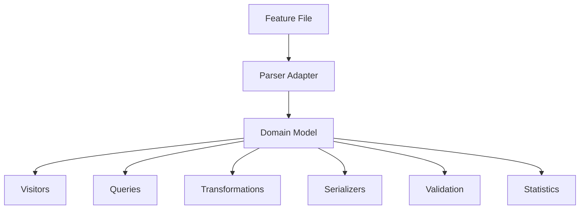

# behave-model

**The canonical object model for [Behave](https://github.com/behave/behave) projects.**

`behave-model` provides a clean, stable, and extensible Python API that represents every element of a Behave project — features, rules, scenarios, steps, tags, tables, docstrings, and more.

---

## Key Features

- **Clean domain model** — Pure dataclasses, no external runtime dependencies beyond Behave
- **Compatible with Behave 1.3.x** — Tag Expression v2 and Gherkin v6 (including `Rule` blocks)
- **Visitor pattern** — Traverse the entire tree with custom visitors (DFS & BFS)
- **Query API** — Find features, scenarios, steps, and tags by name, tag, or keyword
- **Serializers** — Dict, JSON, and pretty-printed Gherkin output
- **Transformations** — Safe in-place modifications (rename tags, sort, normalize)
- **Validation framework** — Pluggable rules with built-in checks
- **Statistics** — Project metrics out of the box
- **95% test coverage** — Comprehensive unit, integration, and golden file tests

---

## Installation

```bash
pip install behave-model
```

From source:

```bash
git clone https://github.com/MathiasPaulenko/behave-model.git
cd behave-model
pip install -e ".[dev]"
```

---

## Quick Example

```python
from behave_model import load_project

# Load all .feature files from a directory
project = load_project("features/")

# Access features and Gherkin v6 Rules
print(len(project.features))           # number of features
print(len(project.features[0].rules))  # rules (Gherkin v6)

# Query scenarios by tag
for scenario in project.find_scenarios(tag="@smoke"):
    print(f"  {scenario.name}")

# Get project statistics
stats = project.statistics()
print(f"{stats['features']} features, {stats['scenarios']} scenarios")
```

---

## Architecture at a Glance



Each layer has a single responsibility and can be used independently. Read the [Architecture Overview](architecture.md) for details.

---

## Documentation Sections

| Section | Description |
| --- | --- |
| [Getting Started](getting-started/installation.md) | Install and run your first project in 5 minutes |
| [Guides](guides/domain_model.md) | In-depth guides for each subsystem |
| [API Reference](api/overview.md) | Complete class and function reference |
| [Architecture](architecture.md) | Layered design and design decisions |
| [Examples](examples.md) | Real-world usage patterns |
| [Changelog](changelog.md) | Release history and breaking changes |
| [Contributing](contributing.md) | How to contribute to the project |

---

## Compatibility

| Feature | Behave 1.3.x | behave-model |
| --- | --- | --- |
| Gherkin v6 `Rule` keyword | Yes | Yes |
| Tag Expression v2 | Yes | Yes |
| Scenario Outlines & Examples | Yes | Yes |
| Data Tables | Yes | Yes |
| DocStrings | Yes | Yes |
| Backgrounds (Feature & Rule) | Yes | Yes |
| Multi-language support | Yes | Yes |

---

## License

MIT — see [LICENSE](https://github.com/MathiasPaulenko/behave-model/blob/main/LICENSE) for details.
